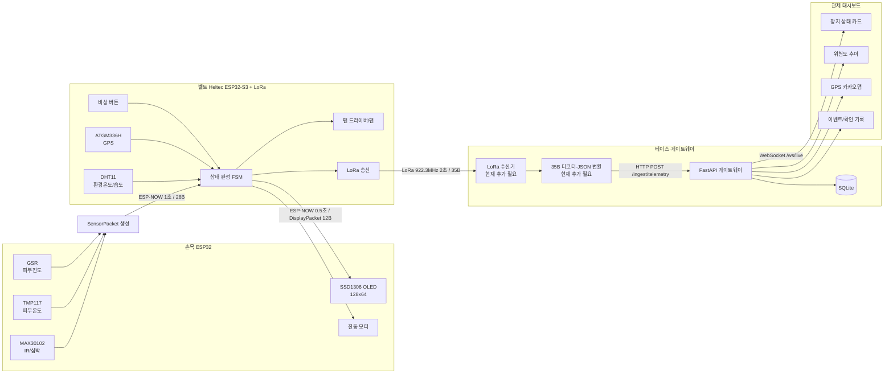

# HeatSentry 실물 하드웨어·통신·대시보드 통합 가이드

> 기준일: 2026-08-30  
> 소프트웨어 저장소: <https://github.com/yeoniix/heatsentry-tac>  
> 확인한 저장소 기준 커밋: `5dc9e50` (`feat: add GPS map to dashboard`)  
> 확인한 실물 펌웨어: `gloves_ESP32/gloves_ESP32.ino`, `gloves_ESP32/display_protocol.h`, `esplora_sen/esplora_sen.ino`

이 문서는 HeatSentry의 실물 손목 장치와 벨트 장치가 무엇을 측정하고, 어떻게 서로 통신하며,
벨트가 만든 데이터를 게이트웨이와 관제 대시보드까지 전달하는지를 재현 가능한 수준으로 설명한다.

HeatSentry는 의료 진단 장비가 아니다. 표시되는 심박, 피부온도, 환경값과 위험 상태는 현장 안전을
보조하기 위한 정보이며, 의식 저하·무응답·열질환 의심 증상이 있으면 장치 상태와 관계없이 현장
응급 절차를 우선해야 한다.

문서 작성에 사용한 최종 로컬 파일의 SHA-256은 다음과 같다. 이후 코드가 바뀌었는지 판단할 때 이
값과 비교할 수 있다.

| 파일 | SHA-256 |
| --- | --- |
| `gloves_ESP32.ino` | `437461259AECBA061A72F6E6CFEF52A70EAAD10C1633B41B96C7D7FB89A8D724` |
| `display_protocol.h` | `A1D9E8AB7BEECF084C23CE42059D87059CD24C51C56F21A4AC380A4DD90F9C4C` |
| `esplora_sen.ino` | `69452A081011E0B85B8E0B8BC0BC1AA6AE87151DD0DEA38D6D0E974C9B4C9C0A` |

---

## 1. 현재 구현 범위부터 정확히 이해하기

### 1.1 실물 하드웨어에서 구현된 기능

- 손목 ESP32가 MAX30102, TMP117, GSR 센서를 읽는다.
- 손목 ESP32가 센서값을 1초마다 ESP-NOW 브로드캐스트로 벨트에 보낸다.
- 벨트 ESP32가 손목 데이터, DHT11 환경 데이터, GPS 데이터, 비상 버튼을 한곳에 모은다.
- 상태 판단은 손목이 아니라 벨트에서 수행한다.
- 벨트가 상태를 0.5초마다 손목으로 다시 보내고, 손목 OLED가 그 결과만 표시한다.
- 손목은 경고 상태를 받으면 진동한다.
- 벨트는 피부온도 또는 비상 상태에 따라 팬을 켜거나 끈다.
- 벨트는 손목·DHT11·GPS·팬·비상 정보를 35바이트 LoRa 패킷으로 2초마다 송신한다.

### 1.2 GitHub 저장소에서 구현된 기능

- Python 기반 RiskIndex/FSM 알고리즘과 결정적 시뮬레이터
- FastAPI 게이트웨이의 `/ingest/*`, `/api/v2/*`, `/ws/live`
- SQLite 텔레메트리·이벤트 저장 및 이벤트 해시체인
- React/Vite 실시간 관제 대시보드
- 장치 상태 카드, 위험도 추이, 경보 확인, 응급 확인 기록, GPS 카카오맵
- 실물 벨트의 35바이트 LoRa 패킷을 푸는 Python 디코더 `common/glove_packets.py`

### 1.3 아직 자동으로 연결되지 않은 부분

현재 저장소에는 **LoRa 전파를 실제로 수신하여 35바이트를 Python에 넘기는 베이스 수신기/시리얼
브리지 프로그램이 없다.** 따라서 벨트의 `LoRa TX DONE`만으로 대시보드에 자동 표시되는 것은 아니다.

또한 현재 35바이트 LoRa 패킷에는 센서값과 플래그만 있고 다음 값이 없다.

- 벨트가 판정한 `state`
- 판정 원인 `cause`
- 정확한 `fanPercent`
- `risk_index`

따라서 현재 패킷만으로는 대시보드가 벨트의 `WARNING`, `DANGER`, `HIGH_RISK`를 완전히 구분할 수
없다. 이 문서의 12장에서 다음 두 연결 방법을 설명한다.

1. 펌웨어를 바꾸지 않고 35바이트를 사용하여 원시 센서·GPS와 제한된 상태를 표시하는 방법
2. 벨트를 상태 판단의 유일한 기준으로 유지하기 위해 LoRa 패킷에 상태 필드를 추가하는 권장 방법

저장소의 기존 기준 문서는 시뮬레이터 기준으로 손목 노드가 RiskIndex/FSM을 계산하고 BLE 또는
HTTP 등가 경로를 사용한다고 설명한다. 실물 최종 설계는 벨트가 상태를 계산하고 ESP-NOW+LoRa를
사용하므로 `README.md`, `docs/architecture.md`, `firmware/api_contract.md`도 이 문서와 함께 갱신해야
역할 설명이 충돌하지 않는다.

---

## 2. 전체 시스템 구조



핵심 원칙은 다음과 같다.

- 센서 취득은 손목과 벨트에서 나누어 수행한다.
- 착용자에게 즉시 필요한 상태 판단과 팬 제어는 벨트에서 수행한다.
- 손목 OLED는 자체 판단을 하지 않고 벨트가 보낸 상태를 표시한다.
- 서버와 대시보드가 끊겨도 손목↔벨트 로컬 폐루프는 계속 작동한다.
- 대시보드는 수신·저장·표시·확인 기록을 담당하며, 현장 팬을 직접 제어하지 않는다.

---

## 3. 권장 저장소 배치

실물 코드를 GitHub 저장소에 올릴 때는 역할이 바로 보이도록 다음 구조를 권장한다.

```text
heatsentry-tac/
├─ firmware/
│  ├─ glove_esp32/
│  │  ├─ glove_esp32.ino
│  │  └─ display_protocol.h
│  ├─ belt_heltec/
│  │  └─ belt_heltec.ino
│  └─ api_contract.md
├─ common/
│  └─ glove_packets.py
├─ server/
├─ dashboard/
├─ docs/
│  └─ hardware_integration_kr.md   # 이 문서
└─ README.md
```

Arduino IDE는 폴더명과 메인 `.ino` 파일명이 같을 때 다루기 편하다. 업로드 시에는 현재 파일을
다음과 같이 이름만 정리하면 된다.

| 현재 로컬 파일 | 저장소 권장 위치 |
| --- | --- |
| `gloves_ESP32/gloves_ESP32.ino` | `firmware/glove_esp32/glove_esp32.ino` |
| `gloves_ESP32/display_protocol.h` | `firmware/glove_esp32/display_protocol.h` |
| `esplora_sen/esplora_sen.ino` | `firmware/belt_heltec/belt_heltec.ino` |

`message.txt`는 화면 문구를 설계할 때 사용한 Python 초안이며 현재 ESP32 런타임에서 호출되지 않는다.
최종 OLED 문구의 기준은 `gloves_ESP32.ino`의 `updateDisplay()`다.

---

## 4. 하드웨어 구성

### 4.1 손목 장치

| 부품 | 역할 | 코드에서 사용하는 인터페이스 |
| --- | --- | --- |
| ESP32 Dev Module | 센서 취득, ESP-NOW, OLED, 진동 | Wi-Fi/ESP-NOW, I2C, ADC, GPIO |
| MAX30102 | IR 기반 손가락 감지 및 심박 계산 | I2C, 기본 주소 `0x57` |
| TMP117 | 피부 접촉 온도 | I2C, 일반적인 기본 주소 `0x48` |
| GSR 센서 | 피부전도 원시값 | ADC |
| SSD1306 OLED 128x64 I2C | 벨트가 계산한 상태 표시 | I2C, 주소 `0x3C` |
| 소형 진동 모터 + 구동회로 | 경고 촉각 알림 | GPIO 제어 |

### 4.2 벨트 장치

| 부품 | 역할 | 코드에서 사용하는 인터페이스 |
| --- | --- | --- |
| Heltec ESP32-S3 LoRa 계열 보드 | 상태 계산, 팬, GPS/DHT, ESP-NOW, LoRa | Wi-Fi/ESP-NOW, UART, GPIO, 내장 LoRa |
| DHT11 | 환경온도·습도 | 단일 DATA GPIO |
| ATGM336H | 위치, 고도, 속도, 위성 수 | UART 9600bps |
| 비상 버튼 | 수동 SOS | `INPUT_PULLUP` GPIO |
| 2채널 모터 드라이버 | 팬 전원 구동 | GPIO 두 개 |
| 냉각 팬 2개 | 착용자 냉각 | 모터 드라이버 출력 |

벨트 코드는 GPIO47을 사용하므로 일반 ESP32가 아니라 해당 핀이 있는 ESP32-S3 계열을 전제로 한다.
Heltec 보드 모델이 바뀌면 먼저 보드 핀맵과 `LoRaWan_APP.h` 지원 여부를 다시 확인해야 한다.

### 4.3 베이스 장치

대시보드까지 실물 데이터를 전달하려면 다음이 추가로 필요하다.

- 벨트와 같은 LoRa 설정을 사용하는 수신 보드
- 수신 보드와 게이트웨이 PC 또는 Raspberry Pi 사이의 USB 시리얼 연결
- 시리얼에서 받은 35바이트를 `TelemetryV2` JSON으로 변환하는 브리지 프로세스
- FastAPI 서버와 React 대시보드를 실행할 PC 또는 Raspberry Pi

---

## 5. 배선

### 5.1 손목 ESP32 배선

MAX30102, TMP117, SSD1306 OLED는 같은 I2C 버스를 공유한다.

| 장치 단자 | ESP32 핀 | 비고 |
| --- | ---: | --- |
| MAX30102 SDA | GPIO21 | I2C 공용 SDA |
| MAX30102 SCL | GPIO22 | I2C 공용 SCL |
| TMP117 SDA | GPIO21 | I2C 공용 SDA |
| TMP117 SCL | GPIO22 | I2C 공용 SCL |
| OLED SDA | GPIO21 | I2C 공용 SDA |
| OLED SCL | GPIO22 | I2C 공용 SCL |
| OLED VCC | 3.3V | 모듈 사양 확인 |
| OLED GND | GND | 모든 장치 공통 GND |
| GSR AO | GPIO34 | 12비트 ADC 입력, 0~4095 |
| 진동 모터 구동 입력 | GPIO25 | 모터를 GPIO에 직접 연결하지 말 것 |

전원은 사용 중인 센서 모듈 사양을 우선한다. ESP32 GPIO는 3.3V 로직이며 ADC 입력에 3.3V를 넘는
전압을 넣으면 안 된다. 진동 모터는 순간 전류와 역기전력이 있으므로 N-MOSFET 또는 트랜지스터,
보호 다이오드, 모터용 전원을 사용하고 ESP32와 GND를 공통으로 묶는다.

I2C 주소가 기본값일 때는 `0x57`, `0x48`, `0x3C`로 서로 충돌하지 않는다. 문제가 생기면 I2C
스캐너로 실제 주소를 먼저 확인한다. 여러 모듈의 풀업 저항이 병렬로 연결되어 전체 풀업 저항이 너무
낮아지지 않게 주의한다.

### 5.2 벨트 배선

| 장치 단자 | 벨트 GPIO/전원 | 비고 |
| --- | ---: | --- |
| DHT11 DATA | GPIO33 | 최종 변경 핀 |
| DHT11 VCC | 3.3V | 모듈 사양 확인 |
| DHT11 GND | GND | 공통 GND |
| GPS TX | GPIO38 | ESP32의 RX |
| GPS RX | GPIO39 | ESP32의 TX |
| GPS VCC | 3.3V | ATGM336H 모듈 사양 확인 |
| GPS GND | GND | 공통 GND |
| 비상 버튼 한쪽 | GPIO7 | `INPUT_PULLUP` |
| 비상 버튼 다른 쪽 | GND | 누르면 LOW |
| 드라이버 A-1A | GPIO6 | 팬 1 제어 |
| 드라이버 A-1B | GND | 현재 코드 배선 정의 |
| 드라이버 B-1A | GPIO47 | 팬 2 제어 |
| 드라이버 B-1B | GND | 현재 코드 배선 정의 |
| 모터 드라이버 VCC | 5V | 팬·드라이버 사양 확인 |
| 모터 드라이버 GND | 공통 GND | ESP32 GND와 반드시 공통 |

팬을 ESP32 GPIO에서 직접 구동하면 안 된다. 팬 전류는 모터 드라이버와 별도 전원에서 공급하고,
GPIO6/GPIO47은 제어 신호만 보낸다.

### 5.3 DHT11 노이즈 대책

확인된 증상은 팬 모터가 동작할 때 DHT11 읽기가 실패하는 것이었다. 현재 적용한 해결은 DHT11의
VCC와 GND 사이에 약 `100uF` 캐패시터를 추가하는 것이다.

```text
3.3V ----+---------- DHT11 VCC
         |
       + | 100uF 전해 캐패시터
         |
GND  ----+---------- DHT11 GND
```

- 전해 캐패시터의 `+`는 3.3V, `-`는 GND에 연결한다.
- 캐패시터는 DHT11 모듈 가까이에 둔다.
- 고주파 성분을 줄이기 위해 `0.1uF` 세라믹 캐패시터를 병렬로 추가하면 더 안정적이다.
- 팬 드라이버 전원에도 별도의 벌크 캐패시터를 두고 센서 전원선과 모터 전원선을 가능한 한 분리한다.
- 팬 배선은 센서 DATA/GPS 안테나와 떨어뜨리고, 모든 GND는 짧고 확실하게 공통화한다.
- 순간적인 Wi-Fi/ESP-NOW 간섭으로 DHT11이 가끔 실패할 수 있으므로 코드는 3회 재시도한다.

캐패시터는 전원 변동을 줄이는 대책이다. DHT11이 뜨거워지거나 탄 냄새가 나면 전원을 즉시 끄고
VCC/GND 역결선, 5V 오인가, 단락 여부를 확인한 뒤 센서를 교체해야 한다.

### 5.4 GPS 설치 대책

- GPS 안테나는 Heltec LoRa 안테나와 보드에서 가능하면 10cm 이상 이격한다.
- 최초 위치 고정은 실내보다 하늘이 열린 실외에서 시험한다.
- `GPS chars > 0`은 UART 문자가 들어온다는 뜻일 뿐 위치 고정 성공을 뜻하지 않는다.
- 위치가 유효하고 마지막 갱신 후 15초 미만일 때만 `GPS_FIX` 플래그가 켜진다.

---

## 6. 개발 환경과 라이브러리

### 6.1 공통

- Arduino IDE 2.x
- Espressif ESP32 Arduino Core
- 시리얼 모니터: `115200 baud`

손목은 Arduino IDE 보드를 `ESP32 Dev Module`로 사용한 업로드가 확인됐다. 벨트는 실제 Heltec
ESP32-S3 LoRa 보드 모델과 일치하는 보드 항목을 선택해야 한다.

### 6.2 손목 라이브러리

| 헤더 | 설치 라이브러리 |
| --- | --- |
| `WiFi.h`, `esp_now.h`, `Wire.h` | ESP32 Arduino Core 내장 |
| `MAX30105.h`, `heartRate.h` | SparkFun MAX3010x Pulse and Proximity Sensor Library |
| `SparkFun_TMP117.h` | SparkFun TMP117 Arduino Library |
| `Adafruit_GFX.h` | Adafruit GFX Library |
| `Adafruit_SSD1306.h` | Adafruit SSD1306 |

### 6.3 벨트 라이브러리

| 헤더 | 설치/출처 |
| --- | --- |
| `WiFi.h`, `esp_now.h`, `esp_wifi.h` | ESP32 Arduino Core 내장 |
| `DHTesp.h` | DHTesp |
| `HT_TinyGPS++.h` | Heltec 패키지에 포함된 TinyGPS++ 계열 헤더 |
| `LoRaWan_APP.h` | 해당 Heltec 보드 패키지/라이브러리 |

`HT_TinyGPS++.h`와 `LoRaWan_APP.h`는 일반 ESP32 보드 패키지에 없을 수 있다. 컴파일 오류가 나면
임의의 다른 LoRa 라이브러리로 바꾸기 전에 실제 Heltec 보드용 Arduino 패키지를 설치한다.

---

## 7. 손목 펌웨어 동작

### 7.1 초기화 순서

1. 시리얼 115200 시작
2. I2C를 SDA GPIO21, SCL GPIO22로 시작
3. ESP-NOW 시작, 수신 콜백 등록, 브로드캐스트 peer 등록
4. OLED 주소 `0x3C` 초기화
5. 진동 모터 GPIO25 출력 설정
6. ADC를 12비트로 설정
7. TMP117 초기화
8. MAX30102 초기화 및 LED/샘플 설정
9. GSR 기준선 측정
10. 시작 진동 120ms

OLED 초기화 실패 시에는 화면만 포기하고 센서·통신을 계속한다. 반면 TMP117 또는 MAX30102 초기화가
실패하면 현재 코드는 `while (1)`로 정지한다.

### 7.2 MAX30102 심박 처리

- IR 원시값이 `50000`을 넘으면 손가락이 있다고 판단한다.
- SparkFun `checkForBeat()`로 박동 시점을 검출한다.
- 박동 간격으로 순간 BPM을 계산한다.
- `45 < BPM < 180`인 값만 유효하게 사용한다.
- 최근 최대 8개의 유효 BPM 평균을 `beatAvg`로 보낸다.
- 손가락이 떨어지면 BPM과 평균 버퍼를 0으로 초기화한다.

이 값은 의료기기 수준의 심박값이 아니며, 센서 접촉압·움직임·주변광의 영향을 받는다.

### 7.3 TMP117 피부온도

TMP117은 1초마다 읽고 `tempC`에 저장한다. 이 값이 벨트 팬 및 현재 단순 상태 FSM의 핵심 입력이다.

### 7.4 GSR

- 시작할 때 50회 기준선 샘플을 모은다.
- 각 샘플은 ADC를 10번 읽어 평균낸 값이다.
- 사용자가 움직이지 않은 상태에서 기준선을 잡아야 한다.
- 이후 200ms마다 필터된 값을 읽는다.
- `gsrDiff = gsrValue - gsrBaseline`로 전송한다.

현재 벨트의 단순 FSM은 GSR을 LoRa로 전달하지만 상태 전이에 사용하지 않는다.

### 7.5 손목의 역할 제한

손목은 상태를 계산하지 않는다. 손목이 수행하는 판단은 센서 전처리와 다음 두 가지 표시 보조뿐이다.

- 벨트 상태 패킷이 3초 이상 오지 않으면 `LINK LOST / CHECK BELT / ESP-NOW WAIT`
- 벨트 상태가 `WARNING` 이상이고 `EMERGENCY` 이하이면 3초 간격으로 짧게 두 번 진동

---

## 8. 손목↔벨트 ESP-NOW 통신

### 8.1 통신 방향

| 방향 | 패킷 | 주기 | 목적 |
| --- | --- | ---: | --- |
| 손목 → 벨트 | `SensorPacket` | 1000ms | BPM, 피부온도, GSR, IR, 손가락 상태 |
| 벨트 → 손목 | `DisplayPacket` | 500ms | 벨트가 계산한 상태, 원인, 팬, 표시값 |

손목은 `FF:FF:FF:FF:FF:FF`로 센서 패킷을 브로드캐스트한다. 벨트는 수신 패킷의 송신 MAC이
코드에 등록된 `34:98:7A:BD:7A:2C`일 때만 받아들인다. 벨트는 같은 MAC으로 표시 패킷을
유니캐스트 회신한다.

### 8.2 손목 MAC 확인과 변경

손목 보드가 바뀌면 벨트의 `gloveMac[]`도 바꿔야 한다. 손목에서 다음 코드로 STA MAC을 확인한다.

```cpp
WiFi.mode(WIFI_STA);
Serial.println(WiFi.macAddress());
```

예를 들어 출력이 `34:98:7A:BD:7A:2C`라면 벨트에 다음과 같이 입력한다.

```cpp
uint8_t gloveMac[] = {0x34, 0x98, 0x7A, 0xBD, 0x7A, 0x2C};
```

### 8.3 `SensorPacket` 현재 레이아웃

현재 구조체에는 `packed`가 없다. ESP32 GCC의 일반 정렬에서는 크기가 28바이트이며 `bool` 뒤에
3바이트 패딩이 들어간다.

| 오프셋 | 크기 | C++ 형식 | 필드 | 의미 |
| ---: | ---: | --- | --- | --- |
| 0 | 4 | `int` | `bpm` | 평균 심박 |
| 4 | 4 | `float` | `temp` | 피부온도 °C |
| 8 | 4 | `int` | `gsr` | GSR ADC 값 |
| 12 | 4 | `int` | `gsrDiff` | 기준선 대비 차이 |
| 16 | 4 | `long` | `ir` | MAX30102 IR 원시값 |
| 20 | 1 | `bool` | `finger` | 손가락 감지 |
| 21 | 3 | 패딩 | — | 구조체 정렬 |
| 24 | 4 | `unsigned long` | `seq` | 송신 순번 |

손목과 벨트의 `SensorPacket` 선언은 필드 순서와 형식이 한 글자도 다르면 안 된다. 한쪽만
`packed`로 바꾸면 크기가 달라져 벨트에서 `SIZE ERROR`가 발생한다. 현재 코드를 유지한다면 양쪽에
다음 검사를 추가하는 것이 안전하다.

```cpp
static_assert(sizeof(SensorPacket) == 28, "SensorPacket ABI changed");
```

장기적으로는 패딩에 의존하지 않도록 고정 폭 형식(`uint8_t`, `int16_t`, `uint32_t`)과 `packed`,
magic, version을 넣은 새 프로토콜로 교체하는 편이 좋다.

### 8.4 `DisplayPacket` 12바이트 레이아웃

`display_protocol.h`와 벨트 코드의 구조체가 반드시 같아야 한다.

| 오프셋 | 크기 | 필드 | 변환/의미 |
| ---: | ---: | --- | --- |
| 0 | 2 | `magic` | `0xD15A`, 전송 바이트는 `5A D1` |
| 2 | 1 | `version` | 현재 `1` |
| 3 | 1 | `state` | `StateCode` |
| 4 | 1 | `cause` | `CauseCode` |
| 5 | 1 | `fanPercent` | 현재 0 또는 100 |
| 6 | 1 | `bpm` | 0~255 |
| 7 | 2 | `skinTemp_x100` | `값 / 100 = °C` |
| 9 | 1 | `flags` | 아래 표 참고 |
| 10 | 2 | `seq` | 표시 패킷 순번 |

`DisplayPacket.flags`는 현재 다음과 같다.

| bit | 의미 |
| ---: | --- |
| 0 | 손가락 감지 |
| 1 | 비상 상태 |
| 2 | 팬 ON |
| 3 | 최근 5초 안에 손목 패킷 수신 |

수신 손목은 길이 12바이트, magic `0xD15A`, version `1`을 모두 통과한 패킷만 사용한다.

### 8.5 ESP-NOW 채널과 보안

양쪽 모두 `channel = 0`, `encrypt = false`다. 현재는 두 장치가 AP에 연결되지 않고 STA 모드만
사용하므로 가까운 거리의 시험에서 동작하지만, 한쪽을 Wi-Fi AP에 연결하면 채널이 바뀌어 통신이
끊길 수 있다. 현장 버전에서는 다음을 권장한다.

- 고정 채널을 명시하고 양쪽을 같은 채널로 설정
- peer 암호화 또는 애플리케이션 인증 추가
- DisplayPacket 수신 시 magic뿐 아니라 송신 MAC도 검증
- 송신 완료 콜백, 손실률, 마지막 정상 sequence를 시리얼에 기록

---

## 9. 벨트 상태 판단과 팬 제어

### 9.1 상태 코드

| 값 | 상태 | 손목 OLED 1줄 |
| ---: | --- | --- |
| 0 | `STATE_BOOT` | `BOOT` |
| 1 | `STATE_BASELINE` | `BASELINE` |
| 2 | `STATE_NORMAL` | `NORMAL` |
| 3 | `STATE_WARNING` | `WARNING` |
| 4 | `STATE_COOLING` | `COOLING` |
| 5 | `STATE_DANGER` | `DANGER` |
| 6 | `STATE_HIGH_RISK` | `HIGH RISK` |
| 7 | `STATE_EMERGENCY` | `EMERGENCY` |
| 8 | `STATE_SENSOR_CHECK` | `SENSOR CHECK` |

현재 코드에는 9개 상태가 모두 정의되어 있지만, 실제 `makeDisplayStatus()`가 생성하는 상태는
`BOOT`, `BASELINE`, `NORMAL`, `WARNING`, `DANGER`, `EMERGENCY`, `SENSOR_CHECK` 7개다.
`COOLING`과 `HIGH_RISK`는 화면 준비는 되어 있으나 현재 조건식에서는 생성되지 않는다.

### 9.2 현재 FSM 판정 우선순위

위에서 먼저 만족한 조건이 최종 상태가 된다.

| 우선 | 조건 | 결과 상태 | 원인 |
| ---: | --- | --- | --- |
| 1 | 비상 버튼 상태 활성 | `EMERGENCY` | `NONE` |
| 2 | 부팅 후 3초 미만 | `BOOT` | `NONE` |
| 3 | 손목 데이터가 없거나 5초 초과, Finger NO, BPM ≤ 0 | `SENSOR_CHECK` | `SENSOR` |
| 4 | 유효 착용이 시작된 후 피부온도 ≥ 30.0°C | `DANGER` | `TEMP_UP` |
| 5 | 피부온도 ≥ 29.0°C | `WARNING` | `TEMP_UP` |
| 6 | 유효 착용 후 기준선 10초 미만 | `BASELINE` | `NONE` |
| 7 | 나머지 | `NORMAL` | `NONE` |

주의할 점은 온도 조건이 기준선 완료 여부보다 먼저 검사된다는 것이다. 기준선 측정 중이라도 피부온도가
29°C 이상이면 즉시 `WARNING` 또는 `DANGER`가 된다.

현재 FSM은 GitHub `algorithm/`의 전체 RiskIndex v0.2 알고리즘을 벨트에 포팅한 것이 아니다.
현재 실물 벨트 판정은 피부온도, 손가락/BPM 유효성, 비상 버튼을 이용한 단순 MVP 로직이다. BPM,
GSR, 환경온도는 LoRa 텔레메트리에 포함되지만 `makeDisplayStatus()`의 상태 계산에는 아직 사용되지
않는다.

### 9.3 팬 제어

| 조건 | 팬 1 | 팬 2 |
| --- | --- | --- |
| 비상 활성 | ON | ON |
| 손목 데이터가 없거나 5초 초과 | OFF | OFF |
| 유효 손목 피부온도 ≥ 30.0°C | ON | ON |
| 그 외 | OFF | OFF |

현재 제어는 디지털 ON/OFF이며 실제 PWM 50% 단계는 없다. 따라서 현재 `fanPercent`는 0 또는 100만
전달된다. `STATE_COOLING`의 `FAN 50%` 문구를 실제로 사용하려면 PWM 채널과 듀티 제어를 추가해야 한다.

### 9.4 비상 버튼의 정확한 동작

버튼을 누르면 즉시 `emergencyActive = true`가 되고 팬이 켜진다. 버튼이 눌린 동안
`lastButtonPressTime`이 계속 갱신되며, 버튼에서 손을 뗀 뒤 5초가 지나면 자동으로 비상 상태가
해제된다.

즉, 현재 코드는 “5초 길게 눌러 해제”가 아니라 **“마지막으로 눌린 시점부터 5초 동안 비상 유지”**다.
GitHub 서버 문서의 “현장 물리 확인 전까지 EMERGENCY 래치 유지” 정책과 정확히 맞추려면 향후
별도의 해제 동작을 구현해야 한다.

---

## 10. 손목 OLED 표시

OLED는 `SSD1306 128x64`, I2C 주소 `0x3C`를 사용한다. 벨트에서 받은 상태가 3초 안에 갱신됐을
때만 정상 화면을 표시한다.

| 벨트 상태 | 1줄 | 2줄 |
| --- | --- | --- |
| `BOOT` | `BOOT` | `STARTING` |
| `BASELINE` | `BASELINE` | `STAY STILL` |
| `NORMAL` | `NORMAL` | `HR <bpm> T <temp>C` |
| `WARNING` | `WARNING` | 원인 문자열 |
| `COOLING` | `COOLING` | `FAN <percent>% <cause>` |
| `DANGER` | `DANGER` | `FAN 100% <cause>` |
| `HIGH_RISK` | `HIGH RISK` | `FAN 100%` |
| `EMERGENCY` | `EMERGENCY` | `SOS FAN 100%` |
| `SENSOR_CHECK` | `SENSOR CHECK` | `WEAR GLOVE` |
| 패킷 3초 초과 | `LINK LOST` | `CHECK BELT`, `ESP-NOW WAIT` |

원인 코드는 다음과 같이 표시된다.

| 원인 코드 | OLED 문구 |
| --- | --- |
| `CAUSE_HR_HIGH` | `HR HIGH` |
| `CAUSE_HR_CHANGE` | `HR CHANGE` |
| `CAUSE_TEMP_UP` | `TEMP UP` |
| `CAUSE_GSR_UP` | `GSR UP` |
| `CAUSE_HOT_ENV` | `HOT ENV` |
| `CAUSE_ACTIVE` | `ACTIVE` |
| `CAUSE_SENSOR` | `CHECK BODY` |

---

## 11. 벨트→베이스 LoRa 통신

### 11.1 무선 설정

송신기와 수신기는 다음 값이 모두 같아야 한다.

| 항목 | 값 |
| --- | ---: |
| 주파수 | `922300000 Hz` |
| 출력 | `10 dBm` |
| 대역폭 | `0` — Heltec API의 125kHz 설정 |
| Spreading Factor | `7` |
| Coding Rate | `1` — 4/5 |
| Preamble | `8` symbols |
| 고정 길이 payload | `false` |
| IQ inversion | `false` |
| Radio CRC | `true` |
| 송신 주기 | 2000ms |

주파수·출력·안테나는 실제 사용 국가의 최신 전파 규정과 해당 보드 인증 범위를 별도로 확인해야 한다.

### 11.2 `TelemetryPacket` 35바이트

구조체는 `packed`이며 ESP32 little-endian 순서로 그대로 전송된다. Python 디코더 형식은
`<HBBHBhHhIhHiiBhHB`다.

| 오프셋 | 크기 | 필드 | 단위/변환 |
| ---: | ---: | --- | --- |
| 0 | 2 | `magic` | `0xA55A`, 전송 바이트 `5A A5` |
| 2 | 1 | `version` | `1` |
| 3 | 1 | `nodeId` | 현재 `1` |
| 4 | 2 | `seq` | 0~65535 순환 |
| 6 | 1 | `bpm` | bpm |
| 7 | 2 | `skinTemp_x100` | `/100 = °C` |
| 9 | 2 | `gsr` | 0~65535 |
| 11 | 2 | `gsrDiff` | signed |
| 13 | 4 | `ir` | MAX30102 IR |
| 17 | 2 | `airTemp_x10` | `/10 = °C` |
| 19 | 2 | `humidity_x10` | `/10 = %` |
| 21 | 4 | `latitude_e7` | `/10,000,000 = °` |
| 25 | 4 | `longitude_e7` | `/10,000,000 = °` |
| 29 | 1 | `satellites` | 위성 수 |
| 30 | 2 | `altitude_dm` | `/10 = m` |
| 32 | 2 | `speed_x10` | `/10 = km/h` |
| 34 | 1 | `flags` | 유효성·상태 비트 |

### 11.3 LoRa flags

| bit | 마스크 | 의미 |
| ---: | ---: | --- |
| 0 | `0x01` | 최근 5초 안에 손목 데이터 수신 |
| 1 | `0x02` | 현재 DHT11 읽기 유효 |
| 2 | `0x04` | GPS 위치 유효, age < 15초 |
| 3 | `0x08` | 손가락 감지 |
| 4 | `0x10` | 비상 활성 |
| 5 | `0x20` | 팬 ON |
| 6~7 | — | 예약 |

저장소의 `common/glove_packets.py` 디코더는 35바이트 구조를 정확히 풀지만 현재
`TelemetryFlags` 열거형에는 bit 0~3만 이름이 정의돼 있다. 비상·팬을 사용하려면 다음 두 값을
추가하거나 정수 마스크로 검사해야 한다.

```python
EMERGENCY = 1 << 4
FAN_ON = 1 << 5
```

### 11.4 값이 0일 때의 해석

0 자체만 보고 센서값이 유효하다고 판단하면 안 된다. 반드시 flags를 함께 본다.

- bit 0이 0이면 BPM, 피부온도, GSR, IR은 사용할 수 없는 값이다.
- bit 1이 0이면 환경온도와 습도는 사용할 수 없는 값이다.
- bit 2가 0이면 위도·경도 0은 실제 좌표가 아니라 “Fix 없음”이다.
- Finger NO 또는 BPM 0은 위험도 0이 아니라 `SENSOR CHECK` 계열로 처리해야 한다.

### 11.5 sequence 순환

LoRa `seq`는 `uint16_t`이므로 2초 주기에서 약 36.4시간 후 65535에서 0으로 돌아간다. FastAPI
게이트웨이는 기존 sequence보다 작거나 같은 요청을 중복으로 거부하므로, 브리지에서 다음과 같이
32비트 이상 확장 sequence를 만드는 것이 필요하다.

```text
last_raw가 65000 근처이고 new_raw가 0 근처이면 wrap_count += 1
extended_sequence = wrap_count * 65536 + new_raw
```

벨트가 재부팅되어 sequence가 0이 되는 경우도 있으므로 nodeId별 부팅 세션 또는 브리지의 재시작
정책을 정해야 한다.

---

## 12. LoRa 데이터를 대시보드에 연결하기

### 12.1 실제 데이터 경로

```text
벨트 Radio.Send(35B)
  → 베이스 LoRa 수신기 OnRxDone(payload, size, rssi, snr)
  → USB Serial 또는 로컬 프로세스로 35B 전달
  → common.glove_packets.decode_glove_telemetry(payload)
  → TelemetryV2 JSON 생성
  → POST http://127.0.0.1:8000/ingest/telemetry
  → FastAPI 검증·SQLite 저장·WebSocket broadcast
  → React 대시보드 즉시 갱신
```

`common/glove_packets.py`는 디코더일 뿐 LoRa 라디오를 직접 읽지 않는다. 수신 보드의
`OnRxDone()`은 다음 요구조건을 만족해야 한다.

1. 벨트와 LoRa 설정이 완전히 같아야 한다.
2. 수신 길이가 정확히 35인지 확인한다.
3. 첫 두 바이트가 `5A A5`인지 확인한다.
4. payload 전체, RSSI, SNR을 게이트웨이 PC에 전달한다.
5. 다음 패킷을 받도록 다시 RX 연속 모드에 들어간다.

권장 시리얼 한 줄 형식은 다음과 같다.

```json
{"payload_hex":"5aa501010100...총35바이트...","rssi_dbm":-71,"snr_db":8}
```

### 12.2 현재 35바이트를 그대로 쓰는 최소 브리지

다음은 수신기에서 `payload: bytes`, `rssi: int`, `snr: int`를 얻은 뒤 사용할 변환의 기준이다.
현재 패킷에는 벨트의 state와 RiskIndex가 없으므로 `risk_index=255`로 두고 제한된 상태만 추정한다.

```python
from datetime import datetime, timezone
import time
import requests

from common.glove_packets import decode_glove_telemetry

GATEWAY_URL = "http://127.0.0.1:8000/ingest/telemetry"
DEVICE_KEY = ""  # 서버에서 키를 설정했을 때만 입력


def utc_now() -> str:
    return (
        datetime.now(timezone.utc)
        .isoformat(timespec="milliseconds")
        .replace("+00:00", "Z")
    )


def convert_packet(payload: bytes, rssi: int, snr: int, extended_seq: int) -> dict:
    p = decode_glove_telemetry(payload)
    flags = int(p.flags)

    glove_ok = bool(flags & (1 << 0))
    dht_ok = bool(flags & (1 << 1))
    gps_ok = bool(flags & (1 << 2))
    finger_ok = bool(flags & (1 << 3))
    emergency = bool(flags & (1 << 4))
    fan_on = bool(flags & (1 << 5))

    active_errors = []
    if not glove_ok or not finger_ok or p.bpm <= 0:
        active_errors.append("SENSOR_CHECK")
    if not dht_ok:
        active_errors.append("DHT_INVALID")
    if not gps_ok:
        active_errors.append("GPS_NO_FIX")

    # 35B v1에는 정확한 벨트 state가 없으므로 가능한 범위만 표현한다.
    if emergency:
        state = "EMERGENCY"
    elif not glove_ok or not finger_ok or p.bpm <= 0:
        state = "FAULT"
    elif fan_on:
        state = "COOLING"
    else:
        state = "NORMAL"

    return {
        "schema_version": "2.0",
        "gateway_utc": utc_now(),
        "device_id": f"HS-W-{p.node_id:03d}",
        "monotonic_ms": int(time.monotonic() * 1000),
        "state": state,
        "risk_index": 255,
        "valid_weight": 1.0 if glove_ok and finger_ok else 0.0,
        "quality": {
            "ppg": 100 if glove_ok and finger_ok and p.bpm > 0 else 0,
            "skin": 100 if glove_ok else 0,
            "eda": 100 if glove_ok else 0,
            "imu": 0,
        },
        "signals": {
            "hr_bpm": p.bpm if glove_ok else 0,
            "skin_c": p.skin_temp_c if glove_ok else 0.0,
            "activity": "UNKNOWN",
        },
        "cooling": {
            "requested": 4 if emergency else (2 if fan_on else 0),
            "actual_pwm": 100 if fan_on else 0,
            "current_ma": 0,
        },
        "contributions": {},
        "active_errors": active_errors,
        "raw": {
            "gsr": p.gsr if glove_ok else None,
            "gsr_diff": p.gsr_diff if glove_ok else None,
            "ir": p.ir if glove_ok else None,
            "air_temp_c": p.air_temp_c if dht_ok else None,
            "humidity_percent": p.humidity_percent if dht_ok else None,
            "finger_detected": finger_ok,
            "glove_data": glove_ok,
            "dht_data": dht_ok,
            "gps_fix": gps_ok,
            "latitude": p.latitude if gps_ok else None,
            "longitude": p.longitude if gps_ok else None,
        },
        "radio": {"rssi_dbm": rssi, "snr_db": snr},
        "config_version": "hardware-mvp-1",
        "sequence": extended_seq,
    }


def post_telemetry(data: dict) -> None:
    headers = {"X-HS-Device-Key": DEVICE_KEY} if DEVICE_KEY else {}
    response = requests.post(GATEWAY_URL, json=data, headers=headers, timeout=3)
    response.raise_for_status()
```

이 방식으로 장치 카드의 BPM, 피부온도, GSR, 환경온도·습도, Finger, RSSI, GPS와 지도는 표시할
수 있다. 그러나 `WARNING`과 `DANGER`, 정확한 RiskIndex는 패킷에 없으므로 복원할 수 없다.

### 12.3 벨트 판정을 그대로 대시보드에 띄우는 권장 확장

“상태는 벨트에서만 계산한다”는 설계를 유지하려면 LoRa 패킷에 최소 다음 4바이트를 추가한다.

```cpp
uint8_t state;       // StateCode
uint8_t cause;       // CauseCode
uint8_t fanPercent;  // 0~100
uint8_t riskIndex;   // 0~100, 계산 전/불가 255
```

현재 35바이트 뒤에 붙이면 version 2의 총 길이는 39바이트가 된다. 이때 반드시 다음을 함께 변경한다.

1. 벨트 `TelemetryPacket`에 네 필드를 추가하고 `version = 2`로 올린다.
2. `static_assert(sizeof(TelemetryPacket) == 39)`로 확인한다.
3. `common/glove_packets.py`가 version/길이에 따라 v1 35B와 v2 39B를 각각 해석하게 한다.
4. 브리지는 패킷의 state/cause/fan/risk를 `TelemetryV2`로 그대로 변환한다.
5. GitHub `common/schema.py`와 `dashboard/src/types/device.ts`에 필요한 상태를 추가한다.

현재 서버/대시보드의 상태 이름은 다음 7개만 허용한다.

```text
BOOT, BASELINE, NORMAL, WARNING, COOLING, EMERGENCY, FAULT
```

실물 벨트의 상태를 손실 없이 표시하려면 다음 3개도 허용하고 UI 라벨/색상을 정의한다.

```text
DANGER, HIGH_RISK, SENSOR_CHECK
```

수정 대상은 다음과 같다.

| 파일 | 필요한 변경 |
| --- | --- |
| `common/schema.py` | `DeviceStateName` Literal 확장 |
| `dashboard/src/types/device.ts` | `DeviceState`, 순서, 한국어 라벨 확장 |
| `dashboard/src/components/DeviceCard.tsx` | 상태별 카드 CSS 분류 확장 |
| `server/app/state.py` | 어떤 상태에서 alert/emergency를 열지 정책 확정 |
| 테스트 | 새 상태 JSON 수용과 WebSocket 표시 검증 |

반대로 저장소의 7상태 체계를 유지하려면 `DANGER/HIGH_RISK`를 `COOLING`으로, `SENSOR_CHECK`를
`FAULT + active_errors=["SENSOR_CHECK"]`로 매핑할 수 있다. 이 방식은 구현은 간단하지만 벨트 상태의
세부 정보가 사라진다.

---

## 13. FastAPI 게이트웨이 동작

### 13.1 입력

브리지는 다음 주소로 `TelemetryV2` JSON을 보낸다.

```http
POST /ingest/telemetry
Content-Type: application/json
X-HS-Device-Key: <장치 키를 설정한 경우>
```

`server/app/routes_ingest.py`가 Pydantic `TelemetryV2`로 자료형과 범위를 검증한다. 장치 키 설정이
비어 있으면 개발 모드로 인증 없이 받으며, 실제 운용에서는 `HEATSENTRY_DEVICE_KEYS`를 설정한다.

### 13.2 저장과 중복 제거

`server/app/state.py`의 `GatewayStore.ingest_telemetry()`가 다음을 수행한다.

1. 같은 device_id의 마지막 sequence와 비교
2. 새 sequence가 더 크지 않으면 `duplicate_ignored`
3. 최신 장치 상태를 메모리에 갱신
4. SQLite에 텔레메트리와 마지막 장치 상태 저장
5. WebSocket으로 `{"type":"telemetry","data":...}` 전송
6. 이전 state와 다르면 `STATE_CHANGE` 이벤트 생성
7. 이벤트에 이전 해시를 연결하여 해시체인 저장
8. WARNING/COOLING이면 경보, EMERGENCY이면 응급 레코드 생성

기본 SQLite 파일은 `server/heatsentry_gateway.db`이며 `HEATSENTRY_DB_PATH`로 변경할 수 있다.

### 13.3 대시보드 출력

대시보드는 시작할 때 `ws://127.0.0.1:8000/ws/live`에 연결한다.

- 연결 직후 서버는 최신 장치와 최근 이벤트 50개의 `snapshot`을 보낸다.
- 이후 새 텔레메트리는 `telemetry`, 이벤트는 `event` 메시지로 즉시 전달된다.
- WebSocket이 끊기면 `/api/v2/devices`와 `/api/v2/events`를 1.5초마다 REST 폴링한다.
- 장치별 최근 유효 RiskIndex 최대 60개를 위험도 추이에 사용한다.

`DeviceCard.tsx`는 다음을 표시한다.

- 장치 ID와 상태
- RiskIndex
- 심박과 피부온도
- 팬 출력과 냉각 단계
- 가장 큰 위험 기여 원인
- 센서 오류
- GSR, 환경온도·습도, Finger, LoRa RSSI, GPS 위치

`TacticalMap.tsx`는 `raw.gps_fix == true`이고 위도·경도가 유한한 장치만 지도에 표시한다.

---

## 14. 서버와 대시보드 실행

다음 명령은 Windows PowerShell 기준이다.

### 14.1 저장소 준비

```powershell
git clone https://github.com/yeoniix/heatsentry-tac.git
Set-Location heatsentry-tac
py -m venv .venv
.\.venv\Scripts\Activate.ps1
pip install -r server\requirements.txt
```

### 14.2 개발 모드 서버

```powershell
uvicorn server.app.main:app --reload --port 8000
```

브라우저에서 `http://127.0.0.1:8000/`을 열어 다음과 비슷한 응답을 확인한다.

```json
{"message":"HeatSentry gateway (schema_version 2.0) is running","time":"..."}
```

### 14.3 장치 키를 사용하는 서버

```powershell
$env:HEATSENTRY_DEVICE_KEYS='{"HS-W-001":"충분히-긴-임의-비밀키"}'
$env:HEATSENTRY_CORS_ORIGINS='http://127.0.0.1:5173,http://localhost:5173'
uvicorn server.app.main:app --host 0.0.0.0 --port 8000
```

브리지의 `X-HS-Device-Key`도 같은 키여야 한다. 키와 지도 API 키는 Git에 커밋하지 않는다.

### 14.4 대시보드

```powershell
Set-Location dashboard
npm install
Copy-Item .env.example .env.local
npm run dev
```

기본 주소는 `http://localhost:5173`이다. 게이트웨이가 다른 PC에 있으면 `.env.local`에 다음을
추가한다.

```dotenv
VITE_GATEWAY_URL=http://게이트웨이_IP:8000
VITE_KAKAO_MAP_APP_KEY=카카오_JavaScript_키
```

카카오 Developers의 Web 플랫폼에도 `http://localhost:5173`과 실제 운영 도메인을 등록해야 한다.
지도 키가 없어도 장치 카드와 나머지 대시보드는 작동하고, 지도 영역에는 설정 안내가 나온다.

### 14.5 실행 순서

1. FastAPI 게이트웨이 실행
2. LoRa 베이스 수신기 연결
3. LoRa→HTTP 브리지 실행
4. React 대시보드 실행
5. 벨트 전원 ON
6. 손목 전원 ON 및 착용
7. 시리얼과 대시보드에서 sequence가 증가하는지 확인

---

## 15. 펌웨어 업로드와 확인 절차

### 15.1 손목

1. `display_protocol.h`를 `.ino`와 같은 Arduino 스케치 폴더에 둔다.
2. 보드 `ESP32 Dev Module`, 올바른 COM 포트를 선택한다.
3. 업로드 속도가 921600에서 불안정하면 460800 또는 115200으로 낮춘다.
4. 업로드 후 시리얼 모니터를 115200으로 연다.
5. 다음 로그를 확인한다.

```text
Calibrating GSR... keep still.
System ready
GSR baseline = ...
Finger=..., IR=..., BPM=..., Avg BPM=..., Temp=..., GSR=..., GSRdiff=..., Alert=...
```

`Hash of data verified`와 `Hard resetting via RTS pin`은 업로드 성공이다.

### 15.2 벨트

1. 실제 Heltec 보드 모델을 선택한다.
2. DHT11 DATA가 GPIO33인지 다시 확인한다.
3. 손목 MAC이 `gloveMac[]`와 같은지 확인한다.
4. 시리얼 모니터 115200에서 다음 초기화 로그를 확인한다.

```text
[OK] MCU
[OK] BUTTON GPIO7
[OK] FAN1 GPIO6
[OK] FAN2 GPIO47
[OK] DHT11 GPIO33
[OK] GPS UART
[OK] GLOVE PEER
[OK] ESP-NOW
[OK] LoRa TX
Telemetry Size : 35 bytes
Display Size   : 12 bytes
SYSTEM READY
```

### 15.3 정상 데이터 흐름

벨트 시리얼에서 다음을 순서대로 확인한다.

```text
[ GLOVE / ESP32U ]
BPM          : ...
Skin Temp    : ...
Finger       : YES
ESP-NOW age  : 0~수천 ms

[ DHT11 ]
Air Temp     : ...
Humidity     : ...

[ GPS ]
GPS chars    : 계속 증가
Fix          : YES

LoRa bytes   : 35
>>> LoRa TX DONE <<<
```

---

## 16. 단계별 통합 시험

한 번에 전체를 켜기보다 아래 순서로 시험하면 고장 위치를 빠르게 찾을 수 있다.

### 시험 A — 손목 센서 단독

- 손가락을 올리면 `Finger=YES`, IR > 50000
- 몇 초 후 `Avg BPM`이 45~180 범위
- TMP117 온도가 출력
- GSR과 GSRdiff가 출력

### 시험 B — 손목 OLED 단독

- I2C 스캐너에서 `0x3C`, `0x48`, `0x57` 확인
- 부팅 시 `HEATSENTRY / STARTING`
- 벨트가 없으면 3초 이후 `LINK LOST`

### 시험 C — ESP-NOW 왕복

- 벨트에서 `NO DATA`가 아닌 손목 센서값 출력
- 손목 OLED에서 `SENSOR CHECK`, `BASELINE`, `NORMAL` 순서 확인
- 벨트 전원을 끄면 3초 이내 손목에 `LINK LOST`

### 시험 D — 팬

- 시험용으로 피부온도 임계값을 안전하게 시뮬레이션하거나 코드의 테스트 상수를 임시 사용
- 29°C 이상 30°C 미만에서 `WARNING`, 팬 OFF
- 30°C 이상에서 `DANGER`, 팬 두 개 ON
- 테스트 후 임계값을 원래 값으로 복구

### 시험 E — DHT11 노이즈

- 팬 OFF에서 연속 DHT 성공
- 팬 ON에서도 캐패시터 적용 후 대부분 성공
- 실패 시 `[DHT11] retry` 후 회복하는지 확인
- 팬 ON 때만 계속 실패하면 전원·배선 분리와 드라이버 억제를 보강

### 시험 F — GPS

- `GPS chars`가 증가하면 UART 배선 정상
- 야외에서 위성 수와 위치 Fix 확인
- Fix 후 flags bit2, 즉 `0x04`가 포함되는지 확인

### 시험 G — LoRa

- 벨트 `LoRa bytes : 35`
- 벨트 `LoRa TX DONE`
- 베이스 수신 길이 35
- payload 시작 `5A A5 01 01`
- RSSI/SNR 기록

### 시험 H — 서버·대시보드

- 브리지 POST 응답 `status: ok`
- `/api/v2/devices`에 `HS-W-001` 생성
- 대시보드 카드의 seq가 증가
- GPS Fix 후 지도 마커 표시
- WebSocket을 끊어도 1.5초 REST 폴링으로 갱신

---

## 17. 문제 해결표

| 증상 | 가능한 원인 | 확인/해결 |
| --- | --- | --- |
| 손목 시리얼이 완전히 비어 있음 | 잘못된 COM 포트, baud, 업로드 실패, 전원 문제 | COM 확인, 115200, 리셋 버튼, USB 데이터 케이블 확인 |
| 업로드 중 `Unable to verify flash chip connection` | 921600 업로드 불안정, USB 케이블/허브, 전원 노이즈 | 업로드 속도 낮춤, 허브 제거, 센서/모터 전원 분리 후 업로드 |
| 벨트 `NO DATA` | 손목 MAC 불일치, ESP-NOW 채널, 손목 미부팅 | STA MAC 재확인, 양쪽 채널 통일, 손목 로그 확인 |
| 벨트 `SIZE ERROR` | SensorPacket 선언/정렬 불일치 | 양쪽 선언 비교, `sizeof` 28 확인 |
| 손목 OLED `LINK LOST` | 벨트 송신 실패, peer MAC 불일치, 3초 timeout | 벨트 `[DISPLAY] SEND ERROR`, MAC, 전원 확인 |
| OLED가 검은 화면 | 주소가 0x3C 아님, SDA/SCL 반대, 전원 문제 | I2C 스캐너, 주소 변경, GPIO21/22 확인 |
| MAX30102/TMP117 init failed | I2C 배선/전원/주소 문제 | 센서 하나씩 연결, I2C 스캔, 풀업 확인 |
| 심박 0 | 손가락 없음, IR < 50000, 움직임, 광학 접촉 불량 | IR 로그 확인, 밀착, LED 세기/임계값 조정 |
| DHT11 READ FAILED | 모터 노이즈, 전원 강하, 배선, 손상 | GPIO33, 100uF+0.1uF, 전원 분리, 센서 교체 |
| GPS chars 0 | GPS TX와 GPIO38 미연결, baud/전원 문제 | TX→RX 교차 배선, 9600bps 확인 |
| GPS chars 증가하지만 NO FIX | 실내, 안테나 간섭, 콜드 스타트 | 야외 이동, 안테나 이격, 충분히 대기 |
| `LoRa TX DONE`인데 베이스 무수신 | 주파수/SF/BW/CR/IQ 불일치, 안테나 | 표 11.1 전체 대조, 안테나 연결 |
| 서버 POST 422 | TelemetryV2 필드/범위/상태 불일치 | 응답 body의 validation error 확인 |
| 서버 `duplicate_ignored` | sequence 중복/감소/16비트 wrap | 확장 sequence 구현 |
| 카드에는 뜨지만 지도 없음 | `gps_fix=false`, 좌표 null, Kakao 키/도메인 | JSON raw, `.env.local`, Kakao 플랫폼 확인 |
| DANGER를 POST하면 422 | 현재 서버 상태 enum에 DANGER 없음 | 스키마 확장 또는 COOLING으로 명시적 매핑 |
| RiskIndex가 `—` | 35B 패킷에 RiskIndex 없음, 값 255 | 전체 알고리즘 포팅 또는 v2 패킷 확장 |

---

## 18. 현재 구현의 제한과 다음 개선 순서

### 필수 통합 작업

1. 베이스 LoRa 수신기와 시리얼 출력 구현
2. 시리얼→35B 디코더→`POST /ingest/telemetry` 브리지 구현
3. 16비트 LoRa sequence wrap 처리
4. bit4 Emergency와 bit5 Fan을 Python enum에 추가
5. 실제 벨트 상태를 보낼지, 대시보드에서 축약 매핑할지 결정

### 정확도·기능 개선

1. GitHub의 전체 RiskIndex/FSM을 벨트에 포팅하거나 벨트용 경량판으로 명세
2. BPM·GSR·환경온도를 벨트 상태 계산에 반영
3. `COOLING`, `HIGH_RISK` 전이 조건 구현
4. 팬 PWM 50/100% 단계 구현
5. 팬 전류·회전 검출을 추가해 “명령”과 “실제 동작”을 구분
6. 배터리 전압/잔량 측정 추가

### 통신 신뢰성 개선

1. SensorPacket을 고정 폭 packed/versioned 형식으로 교체
2. ESP-NOW 채널 고정과 암호화
3. DisplayPacket 송신자 MAC 검증
4. LoRa 애플리케이션 수준 CRC 또는 메시지 인증 추가
5. 패킷 손실률, RSSI/SNR, 마지막 수신 age 관제 표시

### 안전 정책 정합성 개선

1. 현재 5초 자동 해제 비상 동작과 “현장 확인 전까지 래치” 정책 중 하나를 공식 결정
2. 팬 드라이버 고장·과전류·저전압 시 안전 상태 정의
3. 센서 데이터가 오래됐을 때 팬을 끄는 현재 정책이 요구사항에 맞는지 위험 분석
4. 대시보드 확인과 실제 장치 비상 해제를 계속 분리

---

## 19. 재현 완료 체크리스트

### 손목

- [ ] ESP32 Dev Module에 손목 코드 업로드
- [ ] I2C GPIO21/22 확인
- [ ] OLED `0x3C`, TMP117 `0x48`, MAX30102 `0x57` 확인
- [ ] GSR AO GPIO34 확인
- [ ] 진동 모터 구동회로 GPIO25 확인
- [ ] 손목 STA MAC 기록
- [ ] Finger, BPM, TMP117, GSR 시리얼 확인

### 벨트

- [ ] Heltec 보드 모델과 Arduino 보드 설정 일치
- [ ] `gloveMac[]`를 실제 손목 MAC으로 설정
- [ ] DHT11 DATA GPIO33
- [ ] DHT11 VCC-GND 100uF, 필요 시 0.1uF 병렬
- [ ] GPS TX→GPIO38, GPS RX←GPIO39, 9600bps
- [ ] 비상 버튼 GPIO7-GND
- [ ] 팬 드라이버 GPIO6/GPIO47, 공통 GND
- [ ] TelemetryPacket 35B, DisplayPacket 12B 확인

### 로컬 폐루프

- [ ] 손목→벨트 센서 1초 전송
- [ ] 벨트→손목 상태 0.5초 전송
- [ ] 3초 통신 손실 화면 확인
- [ ] 기준선 10초 후 NORMAL 확인
- [ ] WARNING/DANGER/EMERGENCY와 팬 확인
- [ ] 경고 진동 확인

### LoRa·관제

- [ ] 양쪽 LoRa 설정 일치
- [ ] 베이스에서 35B와 magic 수신
- [ ] RSSI/SNR 확보
- [ ] 브리지에서 flags 기반 null/유효값 처리
- [ ] sequence wrap 처리
- [ ] FastAPI `/ingest/telemetry` 응답 ok
- [ ] 장치 카드 실시간 갱신
- [ ] GPS Fix 후 지도 표시
- [ ] 실제 벨트 state 전달 방식 결정 및 문서/코드 동기화

---

## 20. 한 문장 요약

현재 HeatSentry 실물 시스템은 **손목이 생체센서를 측정해 ESP-NOW로 벨트에 보내고, 벨트가 상태와
팬을 결정해 손목 OLED로 되돌려 주며, 전체 원시 데이터를 35바이트 LoRa로 송신하는 로컬 폐루프**다.
대시보드까지 완전하게 연결하려면 **베이스 LoRa 수신·HTTP 브리지와 벨트 state/RiskIndex 전달
계약**을 마지막으로 확정해야 한다.
